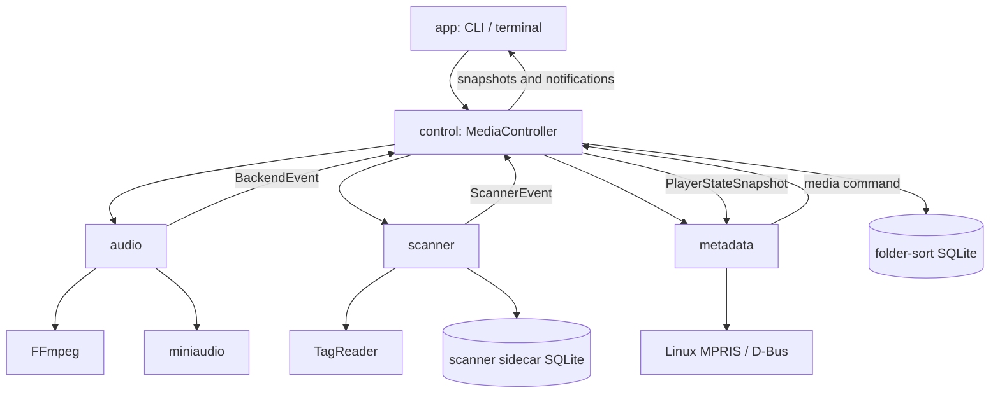
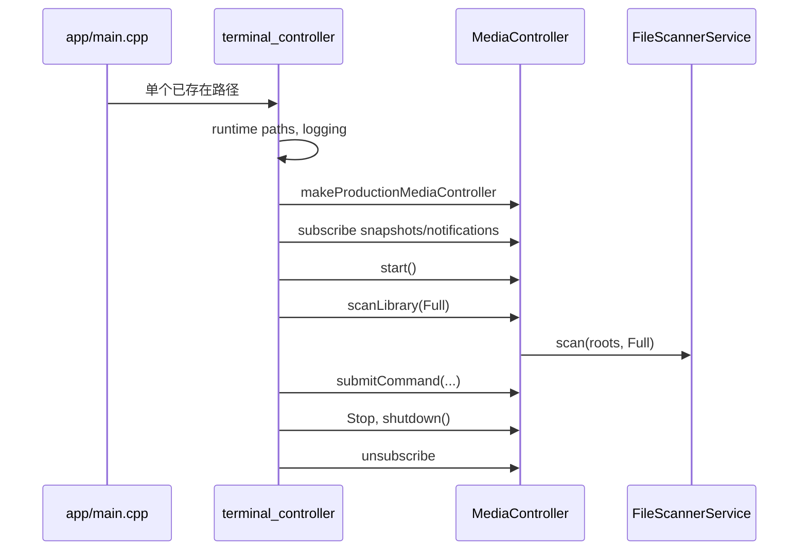
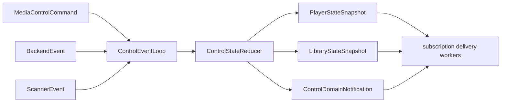
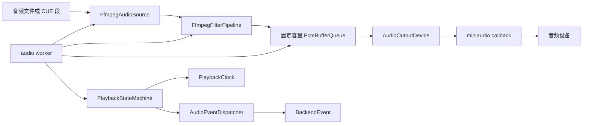
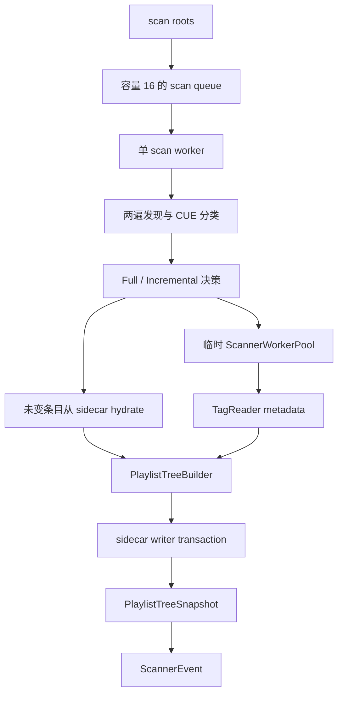
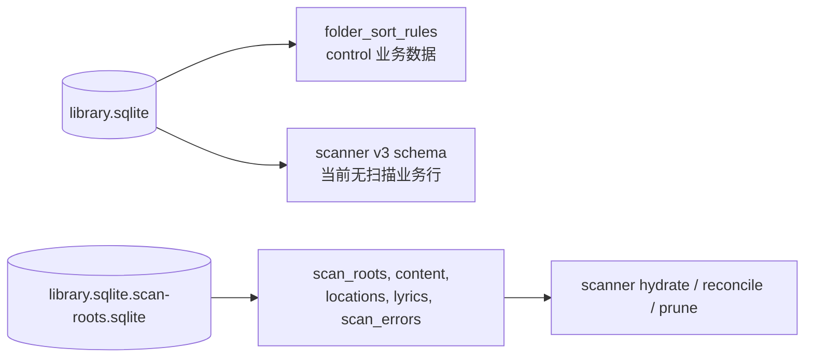
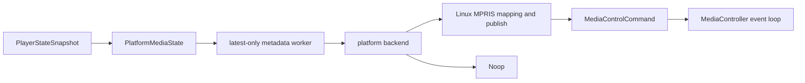

# Seriona 后端当前实现架构

本文记录仓库当前可构建、可执行的 C++23 音乐播放器后端。它以根目录 `CMakeLists.txt`、`inc/seriona/` 公共契约、`src/` 和 `app/` 实现、`tests/` 拓扑为事实来源。本文不记录计划中的功能，也不把旧设计或外部项目的接口当作现行实现。

## 1. 系统边界

Seriona 是独立运行的音乐播放器后端，不依赖 Qt 或 QML。生产模块为：

- `app/`：CLI 入口和终端会话生命周期。
- `src/control/`：跨模块编排、状态归并、播放上下文和订阅。
- `src/audio/`：解码、PCM 缓冲、设备输出、播放时钟和波形。
- `src/scanner/`：文件发现、标签读取、CUE、缓存、播放列表树和监听。
- `src/metadata/`：平台媒体状态镜像和 Linux MPRIS。

日志、运行时路径、SQLite、TagReader 和 watcher 是基础设施，不是额外的业务边界。稳定模块契约位于 `inc/seriona/*/*_contracts.h` 等入口，不暴露 FFmpeg、miniaudio、TagReader、SQLite、watcher、sdbus-c++ 或平台类型。`inc/seriona/` 中仍存在 `scanner/cache`、`worker_pool`、TagReader adapter 和 FFmpeg pipeline 等实现导向头；它们不是跨模块稳定边界。

`thumbnail` 目录中的三个 Qt 文件未跟踪、未加入 CMake 或 CTest，也没有生产消费方。它们是游离草案，不属于当前运行架构。TagReader 和 scanner cache 会携带 `artworkPath` 与 `thumbnailPath`；control 和 metadata 当前只使用 `artworkPath` 发布系统封面，不会调用 `ThumbnailService`。

`MediaController` 是唯一跨模块业务编排点。audio、scanner 和 metadata 不直接相互控制。控制命令向下发送，底层异步事件回到 control 的串行循环，再由 control 发布归并后的快照或领域通知。

## 2. 构建与目标拓扑

根 `CMakeLists.txt` 要求 CMake 3.20+、C++23，并创建以下静态库：

| 目标 | 主要内容 | 依赖关系 |
| --- | --- | --- |
| `seriona_audio` | FFmpeg 解码和 filter、PCM 队列、miniaudio 设备、状态机、波形 | FFmpeg、`BS::thread_pool`、spdlog、头文件形式的 miniaudio |
| `seriona_scanner` | 扫描编排、缓存、哈希、树、歌词、TagReader 适配和 watcher | SQLite3、xxHash、`TagReaderCore`、`BS::thread_pool`、watcher、spdlog |
| `seriona_metadata` | 映射、同步、服务后端和 MPRIS | spdlog，Linux 另加 sdbus-c++ |
| `seriona_control` | 事件循环、reducer、控制器、播放上下文和排序设置 | audio、scanner、metadata、SQLite3、spdlog |
| `seriona_app` | `runtime_paths`、应用日志封装 | spdlog |

`seriona` 可执行文件由 `app/CMakeLists.txt` 直接编译 `main.cpp`、`terminal_controller.cpp`、`terminal_io.cpp`、`src/app/runtime_paths.cpp` 和 `src/logging/logging.cpp`，直接链接 `seriona_control`，Release 配置还直接链接 FFmpeg。`seriona_app` 虽会构建，但当前没有仓库内消费者；运行时和日志源码也存在重复编译。

构建开关为 `SERIONA_BUILD_APP`、`SERIONA_BUILD_TESTS` 和 `SERIONA_BUILD_TOOLS`，默认分别为 ON、ON、OFF。TagReader 优先使用 `SERIONA_TAGREADER_SOURCE_DIR`，其次相邻的 `../TagReader`，最后通过 FetchContent 获取 `main`。线程池固定为 `bshoshany/thread-pool` v4.1.0。`waveform_simd_avx2.cpp` 是唯一带 AVX2/FMA 编译选项的源文件。

`tools/` 只有在 `SERIONA_BUILD_TOOLS=ON` 时加入：`seriona_scanner_cold_perf` 和标记为 `EXCLUDE_FROM_ALL` 的 `seriona_miniaudio_platform_probe`。后者必须显式构建。

## 3. 进程启动、运行时目录与关闭

`app/main.cpp` 只接受一个已存在的路径参数，形如 `build/seriona /path/to/music-root-or-file`。参数数量错误返回 2，路径不存在返回 1；顶层异常被记录后返回 1。

`app/terminal_controller.cpp` 承担生产会话：检查交互终端，解析并创建运行时目录，初始化日志，创建带数据库路径和封面目录的生产 `MediaController`，订阅状态，启动并提交 Full 扫描，再处理终端输入。Unix 与 macOS 使用终端按键；其他平台当前显示键盘控制未实现。

运行时目录在 Linux 是可执行文件旁的 `SerionaData/`，其他平台回退到当前工作目录。其生产布局包括主数据库 `library.sqlite`、扫描 sidecar `library.sqlite.scan-roots.sqlite`、`artwork/` 和 `logs/`。生产启动为每次会话创建时间戳日志文件，并在日志目录总量超过 50MiB 时清理旧文件；文件 sink 内部按 5MiB、3 个轮转文件配置。文件 sink 创建失败时 console sink 对象仍存在，但生产传入的 console level 为 `off`，因此不能依赖终端获得回退日志。

关闭时，`MediaController` 先进入 stopping，清除 audio 和 scanner sink，停止 watcher，注销 metadata 命令回调，停止 metadata，最后停止 control event loop。随后对象析构继续完成模块自身的线程和资源清理：audio worker 在析构时 join 后清空 sink；scanner 析构停止 watcher 和 scan worker；Linux MPRIS 的 D-Bus event loop 在 bus 析构时离开。`ControlEventLoop::stop()` 若由其自身 worker 调用不会 join，正常生产关闭应从外部线程发起。

## 4. Control 模块

公共入口是 `inc/seriona/control/media_controller.h` 和 `control_contracts.h`：

- `MediaController::start()`、`shutdown()`、`submitCommand()`、`scanLibrary()`。
- `subscribePlayerState()`、`subscribeLibraryState()`、`subscribeDomainNotifications()` 返回 `SubscriptionHandle`。
- `PlayerStateSnapshot`、`LibraryStateSnapshot` 和 `ControlDomainNotification` 是上层稳定状态载荷。

`MediaControllerDependencies` 注入 `audio::AudioPlaybackService`、`scanner::FileScannerService`、`metadata::MetadataSharingService` 与 `FolderSortSettingsStore`。生产工厂 `makeProductionMediaController()` 组装 miniaudio audio、scanner、metadata 和 SQLite 文件夹排序存储；无路径重载使用 no-op 排序存储。

内部 `ControlEventLoop` 是一个 worker、无界 `std::deque` 的串行队列。`submitCommand()` 通过 promise/future 等待控制循环给出立即的 `MediaControllerCommandResult`，其含义仅为命令被接受或拒绝。打开文件、扫描、解码等异步结果通过 audio 或 scanner 事件再回流控制循环。`ControlStateReducer` 在这一点串行维护玩家快照、媒体库快照、播放上下文、选中曲目、随机历史和 repeat/shuffle 状态。

订阅回调不运行在 control loop 上。`SubscriptionStore` 为每种订阅建立交付 worker，回调完成前会被追踪，`unsubscribe()` 等待其空闲，从而避免对象销毁后的通知。

播放上下文由 root 或 folder 范围、锚点曲目和 `FolderSortRule` 描述。`SQLiteFolderSortSettingsStore` 以 `(root_path, folder_node_id)` 存储规则 JSON；它只影响构建播放上下文时的排序，不改写 scanner 的 `PlaylistTreeSnapshot`。

`PlayerStateSnapshot.freshness` 和 `LibraryStateSnapshot.version` 属于 control 快照版本。audio `BackendEvent.monotonicVersion` 和 scanner `ScannerEvent.monotonicVersion` 用于丢弃 stale 事件。它们与播放时钟或扫描树版本互不构成全局版本序列。

## 5. Audio 模块

公共契约在 `inc/seriona/audio/audio_contracts.h`。生产稳定入口是 `AudioPlaybackService`，提供输出配置、加载、预载、播放、暂停、恢复、停止、seek、音量、静音、设备偏好与播放时钟查询。`AudioPlayer` 是公开转发门面，但其实现 `src/audio/audio_player.cpp` 当前只由测试目标直接编译，未加入生产 `seriona_audio`。

输入 `TrackPlaybackRequest` 可以包含普通文件，或同时带 `offset`、`duration` 和 `boundedSegment=true` 的 CUE 分段。只有三者都具备时才在播放链路中裁切分段。输出模式是 `AudioOutputMode::Direct` 或 `Mixed`，输出协商结果以 `AudioDeviceFormat` 及 `OutputFormatChanged`、`OutputModeFallback` 回报。

内部链路由单个 audio worker 串行拥有 FFmpeg source、filter pipeline、`PlaybackStateMachine`、`PlaybackClock` 和设备生命周期。其实际数据流如下：

`PlaybackStateMachine` 使用 `Idle`、`Loading`、`Ready`、`Playing`、`Paused`、`Draining`、`Stopped`、`Error`，并以 generation 处理 seek 竞态。`PlaybackClock` 从帧计数生成真实位置。`AudioEventDispatcher` 为对外事件改写单调递增版本，control 用该版本判断陈旧事件。状态机 generation、时钟 version 与对外事件 version 的用途不同，时钟 version 当前没有生产消费者。

miniaudio 回调最终到 `AudioOutputDevice::renderCallback()`。它只从 PCM 队列读取，队列不足时填充静音，应用音量和静音，并更新原子计数。该实时路径不执行 FFmpeg、日志、动态分配、阻塞锁、事件回调或设备生命周期操作。

`Direct` 尝试按源格式协商。失败且允许回退时转为 `Mixed`。`Mixed` 按候选采样率和格式协商。`prepareNext()` 有预载槽并能由下一曲接管。`selectOutputDevice()` 目前只更新偏好设备 ID，在下一次 `loadTrack()` 协商时生效；control 没有对应的媒体控制命令。`AudioOutputConfig::keepDeviceOpen` 存在于公共契约，但当前运行时没有消费它。

波形功能也在 audio 内，由 FFmpeg、标量和 SIMD 策略组成。`inc/seriona/audio/waveform_generator.h` 的 `buildAudioWaveform()` 是已进入 `seriona_audio` 的独立公共工具 API；消费者应显式链接 `SerionaBackend::audio`。`seriona_audio` 私有链接 `BS::thread_pool`，用于波形生成，不应将其与音频实时回调混同。

## 6. Scanner 模块

scanner 的稳定 API 是 `inc/seriona/scanner/scanner_contracts.h` 和 `file_scanner_service.h`。`FileScanner` 是门面，`FileScannerService` 提供 `configure()`、`scan()`、监听启停、`stop()` 与 `snapshot()`。事件为 `ScannerEvent`，结果为扁平节点表表达的不可变 `PlaylistTreeSnapshot`。当前 builder 只生成 `Root`、`Directory` 和 `Track`；CUE 容器也表示为虚拟 `Directory`，公共枚举中的 `Album`、`Disc` 尚未由生产树构建器生成。

`SongMetadata` 是 scanner 的公开歌曲模型，含文件和来源路径、逻辑曲目 ID、content hash、标签字段、技术字段、外部或内嵌歌词、CUE offset/duration、`artworkPath` 与 `thumbnailPath`。scanner 的公共边界不暴露 TagReader 或 SQLite 类型。

每次 `scan()` 进入容量为 16 的扫描队列，由单 scan worker 串行执行 `runScan`。单个 root 内创建临时 `ScannerWorkerPool` 并发读取元数据，TagReader 并发量再由 semaphore 限制。发现阶段为两遍：先解析 CUE 引用，再隐藏被 CUE 接管的音频文件。CUE 错误只隔离到对应文件或条目，不中断整个 root。

scanner 只进行路径、扩展名和视频容器排除。生产 TagReader 适配负责打开输入、读取 stream info、选择最佳音频流，以及签名或容器检测。audio 内的 FFmpeg 打开只服务播放和波形，不承担扫描格式验证。

Full 与 Incremental 的选择使用 sidecar root state、目录 tree hash、当前文件枚举与缓存 location 记录。未变化条目从缓存 hydrate，变化项才进入 worker。每次写入以一个 writer transaction 更新 root、content、location 和 lyrics，再依据本次保留集合 prune；未 commit 自动 rollback。

watcher 回调写入共享状态，debounce 线程以 50ms 去抖后提交 Incremental 请求。文件系统事件仅是需要复查的信号。`FileScannerService::stop()` 当前只设置协作取消标记，不调用 `ScannerWorkerPool::cancel()`，因此不提供对已运行 worker 的硬取消。析构时才停止 watcher 与 scan worker。

## 7. Scanner 缓存与持久化边界

scanner 使用 schema v3，表为 `content`、`locations`、`lyrics`、`scan_roots` 和 `scan_errors`。内容身份只使用时长、规范化标题和规范化艺术家；位置身份基于路径、大小、修改时间，CUE 再加入 offset 与 index。文件系统仍是事实来源，SQLite 是扫描重建与增量判断缓存。

生产配置具有两个容易混淆的数据库文件：

- 主库 `library.sqlite` 被 scanner 打开并初始化同一份 v3 schema，但当前 scanner 业务行不写入这里。它实际被 control 的 `folder_sort_rules` 使用。
- sidecar `library.sqlite.scan-roots.sqlite` 承担 scanner 的 root 状态、content、locations、lyrics 和错误数据。retained location IDs 只存在于单次写事务的请求与临时表中，用来驱动 prune，不是持久化业务表。

`SQLiteCache` 使用 WAL、`synchronous=NORMAL`、500ms busy timeout、外键、64MiB SQLite page cache 和内存临时表。writer transaction 使用 `BEGIN IMMEDIATE`，异常或未提交析构会 rollback。`PRAGMA user_version=0` 直接初始化 v3；非 0 且非 3 的版本报 unsupported。没有 v2 到 v3 迁移桥、备份回滚或应用层缓存容量淘汰。

control 只持久化文件夹排序规则。播放器状态、播放上下文、audio PCM/clock、metadata 镜像和 control 快照不会落盘。`TrackIdentity.sourceId` 与 `libraryId` 在当前生产路径仍可为空。

## 8. Metadata 模块与平台行为

公共入口 `MetadataSharingService` 位于 `inc/seriona/metadata/metadata_contracts.h`。服务暴露 backend kind、capabilities、命令回调注册、`start()`、`update()`、`stop()`，承载 `PlatformMediaState` 和 `MetadataSyncResult`。

control 将最新 `PlayerStateSnapshot` 包装为 `PlatformMediaState`，直接调用 `MetadataSharingService::update()`。服务后端 worker 只保留一条最新 pending update，较早的待发布状态会被覆盖；Linux MPRIS backend 在发布时映射平台 DTO。`MetadataSynchronizer` 和 mapper 源会编入 `seriona_metadata`，但 `MetadataSynchronizer::synchronize()` 当前没有生产调用方，不属于实际发布主链。平台发布失败只记录或返回失败结果，不阻断音频和 control 主链路，control 也不会依据同步结果回滚播放状态。

Linux 在 `src/metadata/metadata_mpris_backend.cpp` 和 `metadata_mpris_linux.cpp` 连接 sdbus-c++，实现 MPRIS 的属性、方法、`PropertiesChanged`、状态发布和命令回流。它可处理 play、pause、toggle、stop、next、previous、seek、set position、volume、repeat 和 shuffle，并通过注册的 control command sink 回到 `MediaController`。

Windows 的 `metadata_windows_private.cpp` 只在 WIN32 编译，是 inert stub：能力全为 false，不发布、不接收命令，生命周期没有平台副作用。生产工厂只在 Linux 自动选择平台 backend，Windows 生产默认仍为 Noop。因此当前没有 Windows SMTC 集成。

`MetadataSharingOptions::allowNoopFallback`、`PlatformMediaState::timelineUpdateInterval` 和同名 options 字段目前未被运行时消费。`platformExtension` 只用于 Windows 工厂可用性门控。未接入生产链的 `MetadataSynchronizer` 按播放位置的整数秒桶判断 cadence，这也不是当前平台发布时间策略。

## 9. 线程、队列与状态归属

| 执行环境 | 队列或同步方式 | 责任 |
| --- | --- | --- |
| 终端主线程 | 终端输入与会话状态 mutex | CLI 渲染、用户命令、启动和关闭 |
| control worker | 无界 `ControlEventLoop` 队列 | reducer、命令、底层事件归并 |
| subscription workers | 每类订阅独立交付队列 | 异步执行上层回调 |
| audio worker | 无界命令队列，约 2ms tick | 解码、filter、状态机、时钟和设备生命周期 |
| miniaudio callback | 固定容量 PCM 队列和原子计数 | 拷贝 PCM、静音、音量、静音 |
| scanner scan worker | 容量 16 请求队列 | 串行编排扫描 |
| 临时 scanner pool | worker pool 和 TagReader semaphore | 单 root 内并发元数据读取 |
| watcher callbacks / debounce thread | 共享观察状态和 50ms debounce | 合并变更并请求 Incremental |
| metadata worker | 单个 latest-only pending slot | 异步平台发布 |
| Linux sdbus event loop | sdbus 异步 event loop | D-Bus 请求与信号 |

状态的真源分层清晰：scanner 树由 scanner 生成，audio clock 和 PCM 由 audio 持有，面向上层的 player/library 状态由 control reducer 持有，metadata 仅是 player snapshot 的派生平台镜像。不存在全局事件版本。

## 10. 错误、退化与可观察性

`MediaControllerCommandResult` 表达同步接受或拒绝，例如控制器停止、无可播放曲目、曲目不在库、无效命令或 backend 拒绝。异步问题通过 `BackendEvent`、`ScannerEvent` 被 reducer 归并为状态或 `ControlDomainNotification`。

audio 错误码覆盖打开、格式、设备、协商、解码、欠载和 seek。scanner 对单文件、CUE、标签读取和缓存写错误尽量局部隔离，必要时回退 Full；若容量 16 的请求队列满，会同步发布 `ScanError`。metadata 失败不影响核心播放。真实音频设备行为仍需要宿主环境验证，测试 fake backend 不能证明操作系统设备可见性或设备 ID 映射。

日志由 `src/logging/logging.cpp` 初始化。生产会话使用时间戳轮转文件，目录级清理阈值为 50MiB；scanner 另有独立的 `tagreader-errors.log` 轮转日志。当前日志可能记录完整音乐路径、数据库路径、封面路径、CUE/TagReader 错误细节和部分媒体元数据，没有统一脱敏层。日志不是模块通信机制，音频实时回调不写日志。

## 11. 测试与工具拓扑

测试基于 doctest。当前源码配置的验证拓扑为：70 个 active 测试可执行文件，其中 68 个承载共 100 个 CTest，另有 2 个仅构建不注册的 scanner 性能目标：`seriona_scanner_perf_test` 和 `seriona_scanner_detailed_perf_test`。`seriona.audio.waveform.perf` 的 CTest 超时为 240 秒，播放状态机 cancellation 有单独注册规则。

5 个目标被明确禁用：旧 cache、cache content、v2 到 v3 migration、backup rollback、phase1 integration。`tests/control/shuffle_playback_tests.cpp` 是孤立源文件，未进入 CMake；`scanner_song_identity_tests.cpp` 由 `scanner_hash_tests.cpp` include，实际通过 `seriona.scanner.song_identity` 注册。

测试以 fake `AudioOutputDeviceBackend` 或现场生成的短音频 fixture 覆盖音频，避免真实硬件与受版权媒体依赖。扫描、缓存、CUE、监听、线程池、metadata、control、运行时路径、日志和终端会话都有相应测试。生命周期和并发聚焦测试覆盖 control、audio、订阅、scanner 与 metadata 的关闭顺序，但不能替代真实 Linux 音频设备和 D-Bus 环境验证。

本次架构审阅重新配置并构建后，全量 CTest 为 98/100：`seriona.scanner.error_logging` 因测试数据库缺少 `cue_track_index` 而 abort，`seriona.scanner_watcher` 的 LRC 场景中 TagReader 调用次数超过断言。其余 audio 38/38、metadata 6/6、control/app 9/9，以及 scanner 其余 44/46 通过。这是当前验证状态，不改变上面的注册拓扑。

## 12. 当前限制与设计债务

以下是已有源码或构建证据的当前限制，不是已落地功能：

- `seriona_app` 没有仓库内消费者，`runtime_paths` 和 logging 源被 app、静态库或测试重复编译。
- scanner 主库仅留下 v3 schema 副作用，实际扫描业务全部在 `.scan-roots.sqlite` sidecar，数据库边界不直观。
- scanner 没有应用层容量上限、LRU eviction 或缓存迁移桥；不支持从非 v3 schema 迁移。
- `FileScannerService::stop()` 是协作取消，未把取消传播至已运行的 worker pool，不提供硬取消。
- `selectOutputDevice()` 不会立即切换设备，且 control 尚无设备选择命令；`keepDeviceOpen` 未消费。
- metadata 的 Windows backend 是编译桩，生产不自动选择，没有 SMTC；`allowNoopFallback` 和 timeline interval 配置未消费。
- `MetadataSynchronizer` 当前虽编入 metadata 库但没有生产调用方；其整数秒桶 cadence 不代表实际平台发布节流。
- 非 Unix 终端键盘控制退化，Windows 还存在 `localtime_r`、POSIX 日志测试和 MPRIS 测试目标的构建兼容性缺口。
- `thumbnail` Qt 草案不属于生产后端，且违反当前无 Qt 生产依赖的系统边界。
- shuffle 测试源孤立，五个已禁用的 cache、迁移和集成测试不提供当前回归保障。

这些限制应在变更时作为边界条件处理，不应被本文解释为已经支持的行为。
