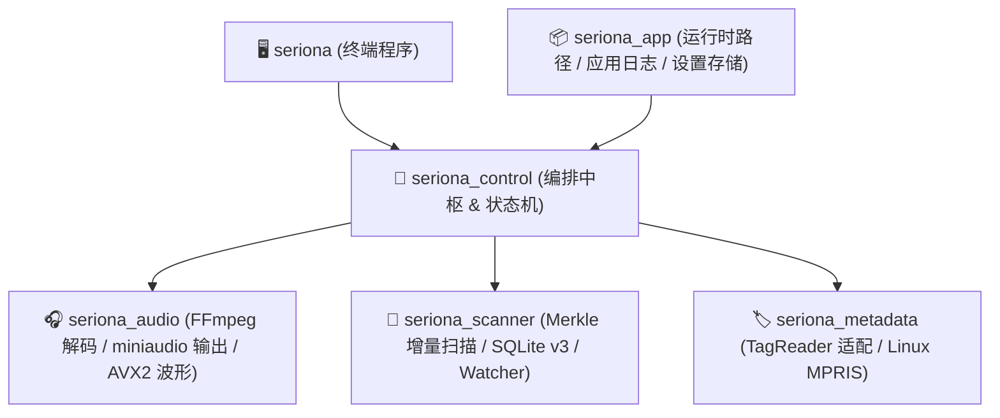

# Seriona_Backend

<div align="center">

**专为现代本地音乐播放器打造的高性能、纯 C++23 核心服务引擎**

[](https://en.cppreference.com/w/cpp/23)
[](https://cmake.org/)
[](./LICENSE)

[简介](#-简介) • [核心特性](#-核心特性) • [快速开始](#-快速开始) • [测试](#-测试) • [架构简述](#-架构简述) • [二次开发集成](#-二次开发集成) • [许可证](#-许可证)

</div>

---

## 📖 简介

**Seriona_Backend** 是音乐播放器 [Seriona](https://github.com/kaizen857/Seriona) 的底层引擎。

它完全与图形界面（Qt/QML）解耦，专注于**高并发目录扫描、增量文件变动监控、元数据 SQLite 高速缓存、低延迟音频解码回放与跨平台媒体控制（MPRIS）**。

---

## ⚡ 核心特性

- 🔍 **十万级曲库极速扫描**：支持全量与 Merkle 树哈希增量扫描，集成文件变动监听（Watcher）实现局部增量更新。
- 💾 **SQLite v3 高性能缓存**：采用 WAL 模式与细粒度读写锁，支持音频内容唯一哈希去重与毫秒级查询。
- 🎧 **专业级音频播放管线**：基于 FFmpeg 解码与动态滤镜重采样 + miniaudio 硬实时渲染输出，低延迟不破音。
- 📊 **AVX2 硬件加速波形提取**：运行时自动选择 AVX2 指令集加速计算全轨音频可视化波形数据。
- 🏷️ **高性能标签与封面解析**：集成 [TagReader](https://github.com/kaizen857/TagReader) 引擎，快速提取元数据与封面并生成内容寻址 PNG 缓存。
- 🐧 **原生 Linux MPRIS 2.x 支持**：基于 `sdbus-c++` 发布 D-Bus 媒体服务，无缝联动系统托盘、锁屏与蓝牙媒体按键。
- 🕹️ **纯函数状态归约**：21 种强类型指令统一汇聚至单事件循环，经状态归约器生成不可变快照推向订阅者。

---

## 🚀 快速开始

### 依赖安装

- **Arch Linux**: `sudo pacman -S cmake ffmpeg xxhash spdlog sqlite sdbus-c++`
- **Ubuntu/Debian**: `sudo apt install -y cmake g++ libavformat-dev libavcodec-dev libavutil-dev libavfilter-dev libswresample-dev libxxhash-dev libspdlog-dev libsqlite3-dev libsdbus-c++-dev pkg-config`

### 编译与运行自带终端播放器

```bash
# 克隆代码
git clone https://github.com/kaizen857/Seriona_Backend.git
cd Seriona_Backend

# 编译
cmake -S . -B build -DCMAKE_BUILD_TYPE=Release -DSERIONA_BUILD_TESTS=ON
cmake --build build -j$(nproc)

# 启动终端播放器并指定音乐目录
./build/seriona ~/Music
```

---

## 🧪 测试

```bash
# 运行全部 doctest 单元测试
ctest --test-dir build --output-on-failure

# 按模块定向测试
ctest --test-dir build -R 'seriona\.audio' --output-on-failure
ctest --test-dir build -R 'seriona\.scanner' --output-on-failure
```

---

## 🏛️ 架构简述

后端划分为 5 个职责明确的静态库（统一导出 `SerionaBackend::*` 别名）：



对外统一通过 `inc/seriona/` 下的纯 C++ 抽象头文件交互，绝不向上层泄漏底层 FFmpeg、SQLite 或 D-Bus 实现细节。运行时路径支持便携（`exeDir/SerionaData`）与安装版（XDG Base Directory）双模式，按构建开关自动选择。

---

## 🔌 二次开发集成

在您的 C++ 项目中通过 CMake 快速集成：

```cpp
#include "seriona/control/media_controller.h"

int main() {
    // 1. 初始化生产依赖（数据库与封面缓存目录）
    auto deps = seriona::control::makeProductionMediaControllerDependencies("/tmp/cache.db", "/tmp/covers");
    auto controller = seriona::control::createMediaController(std::move(deps));

    // 2. 订阅播放状态快照
    auto sub = controller->subscribePlayerStateSnapshot([](const auto& s) {
        std::cout << "当前播放: " << s.trackTitle << "\n";
    });

    // 3. 提交扫描与播放指令
    controller->submitScanCommand({ .roots = {"/home/user/Music"} });
    controller->submitCommand(seriona::control::PlayCommand{});
}
```

---

## 📄 许可证

本项目基于 [GPL-3.0](./LICENSE) 许可证开源。
